<p align="center">
  <picture>
    <source media="(prefers-color-scheme: dark)" srcset="https://readme-typing-svg.demolab.com?font=Cinzel&size=32&duration=3000&pause=500&color=F5C842&center=true&vCenter=true&width=600&lines=PoE2+Mirror+Crafter;Craft+guide+for+mirror-tier+items">
    
  </picture>
</p>

<p align="center">
  <strong>Your path to 6x T1 mirror-tier perfection. Step-by-step.</strong>
</p>

<p align="center">
  <a href="https://github.com/JerkyJesse/poe2-mirror-crafter/blob/main/LICENSE">
    
  </a>
  <a href="https://www.python.org/downloads/">
    
  </a>
  <a href="https://www.pygame.org/">
    =2.0" />
  </a>
  <a href="https://poe2craft.jerkyjesse.com">
    
  </a>
  
  <a href="#tests">
    
  </a>
</p>

---

## What is this?

**PoE2 Mirror Crafter** is a desktop companion that transforms Path of Exile 2's most intimidating challenge — crafting a mirror-tier item — into a clear, priced, step-by-step guide. It replaces wiki-scrolling, spreadsheet-guessing, and price-checking with a single focused window.

From a white base item to a 6x T1 masterpiece with perfect rolls, every orb, every omen, and every decision is laid out. Live prices from **poe.ninja** track what you're spending in real time. Keyboard-driven to keep you in the flow state.


---

## The 10-Phase Pipeline

| # | Phase | What Happens | Key Orbs |
|:-:|-------|--------------|----------|
| **01** | Acquire & Prepare Base | Buy iLvl 82+ exceptional base, quality to 20%, Vaal Infuser | Whetstone / Scrap / Infuser |
| **02** | Magic Stage | Transmute + Augment for T1 modifiers. Scour and repeat until perfect | Perfect Transmute / Augment |
| **03** | Regal & Isolate T1 | Regal orb, isolate your best T1 prefix. Coronation Omen safety net | Perfect Regal / Omens of Coronation |
| **04** | Fracture | Lock your top mod permanently with a Fracturing Orb | Fracturing Orb |
| **05** | Clean Up | Scour unwanted mods, Erasure Omens to clear empty affix slots | Omens of Erasure / Annulment |
| **06** | Fill Slots | Exalted Orbs and Greater Essences to fill all affix slots | Perfect Exalted / Omens of Exaltation |
| **07** | Whittling | Remove the lowest-tier mod repeatedly until all 6 mods are T1 | Omens of Whittling |
| **08** | Divine | Divine Orb all mod values to perfect rolls | Divine Orbs |
| **09** | Finalize | Quality, sockets, links, runes, catalysts, enchantments | Artificer's / Catalysts |
| **10** | Sanctify | Final blessing. Your mirror-tier item is complete. GG, Exile. | Omen of Sanctification |

---

## Supported Items

### Weapons
| Type | Quality Currency | Key T1 Mods |
|------|-----------------|-------------|
| Bow | Blacksmith's Whetstone | Flat Phys, % Phys, Hybrid Phys, Attack Speed, Crit, +Proj |
| Crossbow | Blacksmith's Whetstone | Flat Phys, % Phys, Hybrid Phys, Attack Speed, Crit, +Bolt |
| Wand | Blacksmith's Whetstone | Spell Damage, +Gem Levels, Cast Speed, Crit, Elemental |
| Sceptre | Blacksmith's Whetstone | Spirit, +Gem Levels, Minion Damage, Aura Effect |
| Staff | Blacksmith's Whetstone | Spell Damage, +Gem Levels, Cast Speed, Crit, Flat Ele |
| Quarterstaff | Blacksmith's Whetstone | Flat Phys, % Phys, Hybrid Phys, Attack Speed, Crit |

### Armour
| Type | Quality Currency | Key T1 Mods |
|------|-----------------|-------------|
| Body Armour (STR/DEX/INT/Hybrid) | Armourer's Scrap | Life, ES, Armour/Evasion, Resists, % Attributes, Flat Def |
| Helmet | Armourer's Scrap | Life, ES, Resists, Rarity, +Minion Gems, Accuracy |
| Boots | Armourer's Scrap | Movement Speed, Life, ES, Resists, Rarity |
| Gloves | Armourer's Scrap | Flat Damage, Attack Speed, Life, Resists |
| Shield | Armourer's Scrap | Life, ES, Block, Resists, % Spell Damage |
| Focus | Armourer's Scrap | Spell Damage, Cast Speed, +Gem Levels, ES |

### Jewellery
| Type | Quality Currency | Key T1 Mods |
|------|-----------------|-------------|
| Ring | Catalysts (11 types) | Flat Damage, Life, Resists, Rarity, Attribute |
| Amulet | Catalysts + Distilled Emotions | +Skill Gems, Spirit, Life, Crit Multi, Anoint |
| Belt | Catalysts | Life, Resists, Flask Effect, Charm Slots (max 3) |

---

## Live Price Integration

Every phase shows the real currency cost — per step and cumulative — driven by **poe.ninja** live API data.

```text
 Market Prices (poe.ninja ─ live)
 ┌─────────────────────────────────────────┐
 │  Divine Orb         183c   ← live API   │
 │  Chaos Orb            1c                │
 │  Fracturing Orb     390c   (10.1 div)   │
 │  Omen of Whittling  570c   (15.0 div)   │
 │  Perfect Exalted    108c   (2.83 div)   │
 ├─────────────────────────────────────────┤
 │  Running total:     12.5 Divine Orbs    │
 │  Budget tier:       Standard            │
 └─────────────────────────────────────────┘
```

**Budget tiers** (auto-calculated from live + static prices):

| Tier | Cost (est.) | Approach |
|------|------------|----------|
| **Budget** | &lt; 5 div | Minimal safety, fewer omens. Higher risk of bricking |
| **Standard** | &lt; 20 div | Balanced approach with essential omens |
| **Mirror** | 20-50+ div | Maximum safety, every omen, guaranteed 6x T1 |

---

## Features

<table>
<tr>
<td width="50%">

### Crafting Intelligence

- **10-phase guided pipeline** — never guess which orb comes next
- **Per-step orb lists** — exact currencies needed, no ambiguity
- **Choice alternatives** — safe/expensive vs risky/cheap at key decision points
- **Mod tier guidance** — S-tier keep, trash, and situational mods per item type
- **Fracture priority ordering** — which mods to lock first for maximum value
- **Coronation direction advice** — prefix vs suffix choices explained

</td>
<td width="50%">

### Quality of Life

- **Full keyboard navigation** — arrow keys, Space, Enter, Tab, number keys
- **Auto-save every step** — never lose progress on a multi-day craft
- **Manual save/load** — date-stamped save slots in `%APPDATA%`
- **Live price panel** — always visible, always updating
- **Resizable window** — adapts to any screen size
- **100% local** — no accounts, no cloud, no telemetry

</td>
</tr>
</table>

---

## Installation

```bash
# Clone the repo
git clone https://github.com/JerkyJesse/poe2-mirror-crafter.git
cd poe2-mirror-crafter

# Install the only dependency
pip install -r requirements.txt

# Run it
python main.py
```

> **Requirements:** Python 3.8+ and Pygame 2.0+. Runs on Windows, macOS, and Linux.

---

## Usage

### Keyboard Shortcuts

| Key | Action | Context |
|-----|--------|---------|
| `Arrow Keys` | Navigate menus / phases / alternatives | All screens |
| `Space` / `Enter` | Confirm selection or step | All screens |
| `Tab` | Skip to next phase | Crafting view |
| `1` – `0` | Jump directly to phase 1–10 | Crafting view |
| `S` | Open save/load overlay | Crafting view |
| `L` | Open save/load overlay | Crafting view |
| `B` | Go back to previous screen | Selection / Crafting |
| `R` | Reset current craft | Crafting view |
| `Esc` | Back / quit app | All screens |

### Walkthrough

1. Launch the app. Choose **New Craft** or **Resume Craft** from a save.
2. Select a category: **Weapons**, **Armour**, or **Jewellery**.
3. Pick your item sub-type (e.g. Bow, Ring, Body Armour).
4. Follow the 10-phase guide. Confirm each step with `Space`.
5. At decision points, use arrow keys to choose your strategy.
6. Watch the running total. Know your cost before you commit.
7. Your progress auto-saves. Use `S` to manually save at any time.

---

## Architecture

```mermaid
flowchart TB
    subgraph Entry
        A[main.py] --> B[CraftingApp]
    end

    subgraph Core
        B --> C[renderer.py<br>UI and Particles]
        B --> D[phases/__init__.py<br>Category Router]
        B --> E[prices.py<br>poe.ninja API]
        B --> F[state_manager.py<br>Save / Load]
        B --> G[icon_loader.py<br>Orb Icons]
    end

    subgraph Data
        D --> H[base_phases.py<br>10-Phase Builder]
        D --> I[weapon_phases.py<br>6 Weapons]
        D --> J[armour_phases.py<br>7 Armour Types]
        D --> K[jewellery_phases.py<br>3 Jewellery Types]
    end

    subgraph External
        E <--> L[(poe.ninja API)]
        G <--> M[(poe2db.tw CDN)]
        F --> N[AppData / saves]
    end

    style A fill:#2a1a0a,stroke:#b8780e
    style B fill:#2a1a0a,stroke:#f5c842
    style L fill:#1a1a2e,stroke:#b8780e
    style M fill:#1a1a2e,stroke:#b8780e
```



---

## Project Structure

```
poe2-mirror-crafter/
├── main.py                 # Application entry point
├── crafting_app.py         # State machine, event loop, game logic
├── renderer.py             # All rendering: UI panels, particles, fonts
├── prices.py               # poe.ninja API client + fallback prices
├── state_manager.py        # JSON save/load to AppData
├── icon_loader.py          # Async orb icon downloader + cache
├── requirements.txt        # pygame>=2.0
│
├── phases/
│   ├── __init__.py         # Category definitions + budget tier calculator
│   ├── base_phases.py      # Universal 10-phase pipeline builder
│   ├── weapon_phases.py    # Bow, Crossbow, Wand, Sceptre, Staff, Quarterstaff
│   ├── armour_phases.py    # Body Armour (7 variants), Helm, Boots, Gloves, Shield, Focus
│   └── jewellery_phases.py # Ring, Amulet, Belt
│
├── tests/
│   └── smoke_test.py       # 40+ headless test cases
│
├── docs/                   # Reference crafting guides (~5000 lines)
├── index.html              # Landing page (poe2craft.jerkyjesse.com)
├── styles.css              # Landing page styles
└── assets/fonts/
    └── gothic.ttf          # Dark-fantasy UI font
```

---

## Testing

```bash
# Headless smoke tests (SDL_VIDEODRIVER=dummy — no display needed)
python tests/smoke_test.py
```

The test suite covers every major path through the application:
- Startup screen (New Craft / Resume Craft)
- Category selection (all 3 categories, all sub-types)
- 10-phase crafting pipeline (forward, backward, phase jumping)
- Choice alternatives (selection, confirmation, cost adjustment)
- Save/load cycle (save, quit, load, verify state)
- Keyboard navigation (every bound key on every screen)

---

## Updating for PoE2 Patches

See **[AI_UPDATE_INSTRUCTIONS.md](AI_UPDATE_INSTRUCTIONS.md)** for a comprehensive guide on updating the app after PoE2 patches. It covers:

- External data sources (patch notes, poe2db.tw, poe.ninja)
- Per-file update guide (prices, phases, budget tiers, renderer)
- Step-by-step update procedure
- Validation checklist
- Common pitfalls

---

## FAQ

<details>
<summary><strong>Is this against GGG's Terms of Service?</strong></summary>
<br>
No. PoE2 Mirror Crafter is an offline crafting reference tool. It does not interact with the game client, read game memory, automate inputs, or perform any action that violates GGG's policies. It's a guide — you still do the clicking.
</details>

<details>
<summary><strong>Why a Pygame desktop app instead of a web app?</strong></summary>
<br>
Performance, simplicity, and trust. A single zero-dependency-beyond-Pygame Python script runs identically on all platforms. No server costs. No accounts. No database. Your crafting data stays in your AppData folder. The dark-fantasy atmosphere of Pygame's rendering pipeline also perfectly matches PoE's aesthetic.
</details>

<details>
<summary><strong>How accurate are the prices?</strong></summary>
<br>
When the poe.ninja API is reachable (which it is >99% of the time), prices are as accurate as poe.ninja's Standard league data. If the API is down, the app falls back to hardcoded `FALLBACK_PRICES` which are periodically updated. The price source is displayed on-screen ("live" or "static").
</details>

<details>
<summary><strong>Can I add my own item types?</strong></summary>
<br>
Yes. Edit the appropriate `phases/*_phases.py` file — copy an existing entry as a template and fill in your mod data from poe2db.tw. Then register it in `phases/__init__.py`. See `AI_UPDATE_INSTRUCTIONS.md` for details.
</details>

<details>
<summary><strong>Where are saves stored?</strong></summary>
<br>

| OS | Path |
|----|------|
| Windows | `%APPDATA%\poe2-mirror-crafter\saves\` |
| macOS | `~/Library/Application Support/poe2-mirror-crafter/saves/` |
| Linux | `~/.local/share/poe2-mirror-crafter/saves/` |

</details>

---

## License

MIT — see [LICENSE](LICENSE) for full text.

Built with Pygame by [JerkyJesse](https://github.com/JerkyJesse).  
Landing page: [poe2craft.jerkyjesse.com](https://poe2craft.jerkyjesse.com)

---

<p align="center">
  <sub>Not affiliated with or endorsed by Grinding Gear Games. Path of Exile 2 is a registered trademark of Grinding Gear Games.</sub>
</p>
